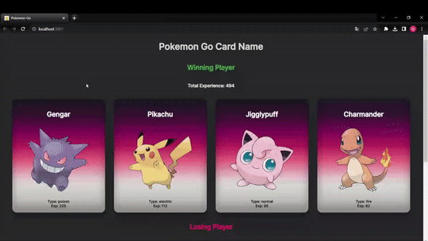

<h1>Pokemon Game</h1>

This project represents a Pokemon game developed via React.js.

<h2>Features</h2>

<ul>
        <li>Created using React</li>
        <li>Full responsive</li>
        <li>Different animations are used</li>
</ul>

<h2>Screen Gif</h2>

